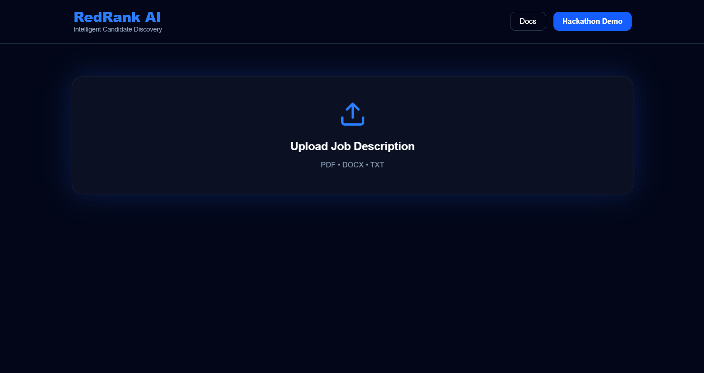
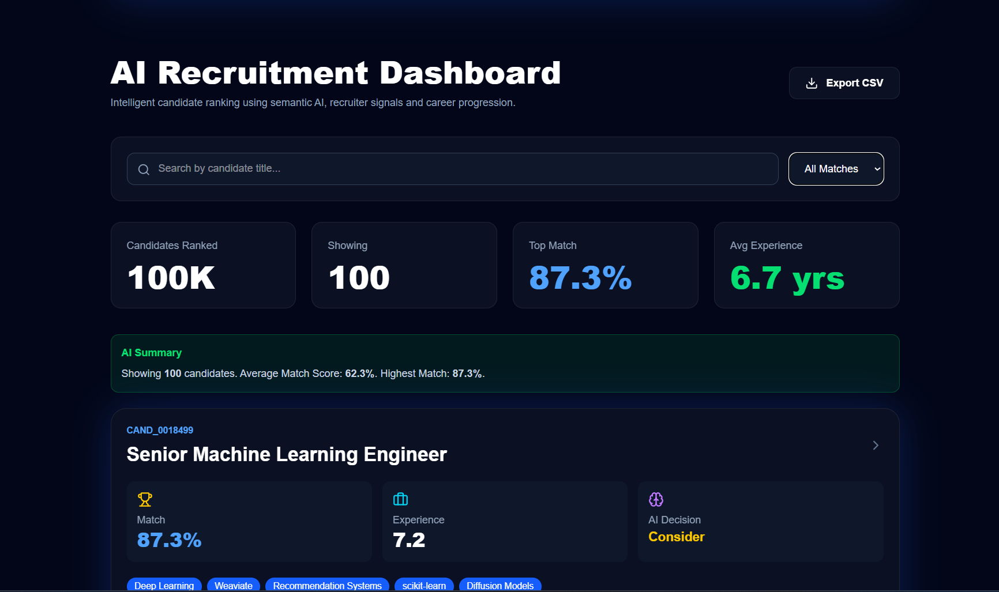
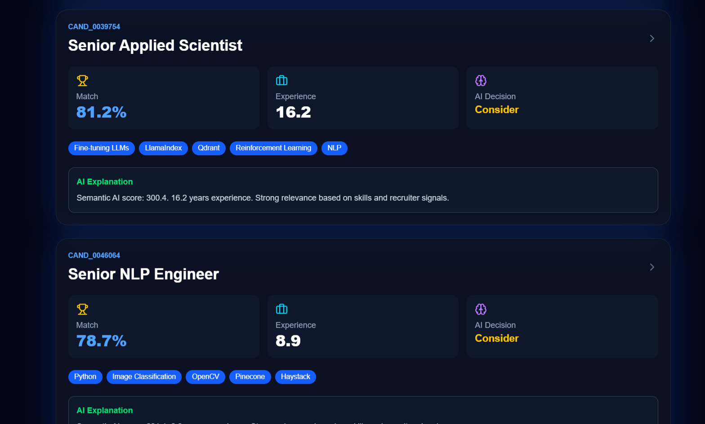

# 🚀 RedRank AI

> AI-powered intelligent candidate discovery and ranking platform.

RedRank AI helps recruiters intelligently rank candidates using semantic AI matching, recruiter signals, skills analysis, and career progression instead of relying on keyword-based filtering.

---

## ✨ Features

- 📄 Upload Job Description (PDF / DOCX / TXT)
- 🤖 AI-powered candidate ranking
- 🎯 Semantic skill matching
- 📊 Match score generation
- 👨‍💻 Candidate search & filtering
- 📈 Recruiter analytics dashboard
- 💡 AI explanation for every recommendation
- 📁 Export ranked candidates to CSV
- ⚡ Fast ranking of 100,000 candidate profiles

---

## 🏗 Architecture

Job Description
↓
JD Parsing
↓
Skill Extraction
↓
Semantic Matching
↓
Candidate Ranking Engine
↓
Top Ranked Candidates
↓
Recruiter Dashboard

---

## 🛠 Tech Stack

### Frontend

- React
- Vite
- Tailwind CSS

### Backend

- Python
- Flask

### AI / Ranking

- Semantic Matching
- Rule-based AI Ranking
- Candidate Skill Analysis
- Career Progression Analysis

---

## 📂 Project Structure

```
RedRank-AI
│
├── Data
├── Scripts
├── recruiter-dashboard
├── Outputs
├── Uploads
├── api.py
├── requirements.txt
└── README.md
```

---

## ⚙ Installation

Clone the repository

```bash
git clone https://github.com/YuvrajGora/RedRankAI.git
```

Install Python dependencies

```bash
pip install -r requirements.txt
```

Run Backend

```bash
python api.py
```

Run Frontend

```bash
cd recruiter-dashboard
npm install
npm run dev
```

---

## 📸 Screenshots

### Landing Page



---

### AI Recruitment Dashboard



---

### Candidate Ranking



---

## 🚀 Future Improvements

- LLM-based resume understanding
- Explainable AI ranking
- Interview scheduling
- Recruiter authentication
- Cloud deployment
- Multi-job comparison

---

## 👥 Team

**The OG Player**

---

## 👨‍💻 Author

**Yuvraj Gora**

---

Built for the RedRob AI Hackathon ❤️
